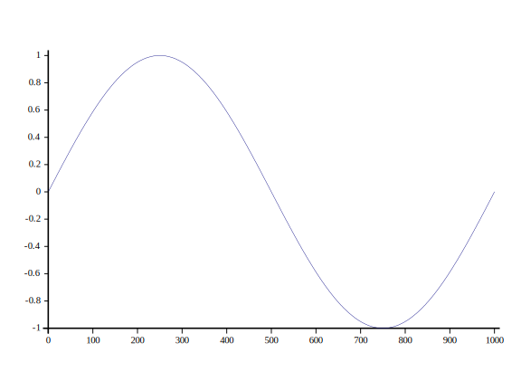

# Data visualisation and graphics
If you are already familiar with plotting functionality in [python](https://rikedyp.uk/DyalogTutorials/website-tools/external-language-interfaces-standard-libraries/#python-pynapl), [R](https://rikedyp.uk/DyalogTutorials/website-tools/external-language-interfaces-standard-libraries/#r-language-rsconnect) or [.NET](https://rikedyp.uk/DyalogTutorials/website-tools/external-language-interfaces-standard-libraries/#net) then you can use one of the [external language bridges](https://rikedyp.uk/DyalogTutorials/website-tools/external-language-interfaces-standard-libraries/) to use these from APL.

## SharpPlot
Dyalog ships with SharpPlot, an application for data visualisation graphics and plotting.

<span class="logo-jupyter">:simple-jupyter:</span> Notebook: [Plotting with SharpPlot](https://github.com/Dyalog/dyalog-jupyter-notebooks/blob/master/Plotting%20with%20SharpPlot.ipynb)

:material-web: [SharpPlot documentation](https://www.sharpplot.com/)

### Simple plots
Use the `]Plot` user command to quickly chart data.

See `]Plot -??` for more information.

```APL
]Plot 1○○0.001×⍳2000   ⍝ Sine wave from 0 to 2π in 0.001 increments
```



### Plotting under program control

```APL
'InitCauseway' 'View'⎕CY'sharpplot'   ⍝ Copy SharpPlot into the workspace
sp←⎕NEW Causeway.SharpPlot            ⍝ Initialise new plot
data ← 1○○0.001×⍳2000                 ⍝ Generate data
sp.DrawLineGraph ⊂data                ⍝ Pass data as a scalar for "just Y values"
View sp                               ⍝ View the plot in a popup window
sp.SaveSvg ⊂'\tmp\sine.svg'           ⍝ Save the plot as an SVG
```

## 3D graphics for simulation and gaming
<span class="logo-youtube">:fontawesome-brands-youtube:</span> Video: [Simulation and Gaming with APL](https://dyalog.tv/APLSeeds21/?v=iC9floP7POU)

Tomas takes you through the API of a 3D-engine and shows you how to connect to it from APL, enabling you to create a simple scene with graphics objects moving in real-time. He also explores some of the more advanced rendering techniques.