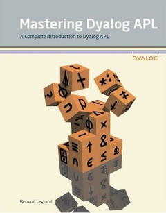

# Mastering Dyalog APL
The book is available for purchase through [Amazon](http://www.amazon.co.uk/Mastering-Dyalog-APL-Complete-Introduction/dp/0956463800/ref=sr_1_1?ie=UTF8&qid=1387290291&sr=8-1&keywords=mastering+dyalog) or as a [free PDF download](https://www.dyalog.com/uploads/documents/MasteringDyalogAPL.pdf "Download pdf"). An [online revision](https://mastering.dyalog.com) is currently being developed (to report errors or make suggestions concerning the online revision, please email [mdapl@dyalog.com](mailto:mdapl@dyalog.com)).

!!! Note
    The book is only available from Amazon in the U.K., irrespective of where you are in the world. It is held on what is effectively a Just In Time basis, so do not be discouraged if it is listed as "Temporarily out of stock" – there are plenty of copies available.

Mastering Dyalog APL is a complete guide to the use of Dyalog, beginning with a thorough introduction to the APL programming language. Following this, the tutorial describes a large number of common coding techniques and discusses a variety of interfaces, including file handling and COM/OLE. Bernard Legrand provides a comprehensive introduction to developing Graphical User Interfaces in Dyalog and wraps up with an overview of the publishing tool NewLeaf and the RainPro graphics engine, both of which are included with Dyalog.

This book is specifically aimed at helping new users get started with Dyalog and advancing them to a point where they can produce working solutions by expressing ideas directly in APL. Step by step, this book gives the reader a thorough grounding in the philosophy of the APL language, and the many examples illustrate the practical capabilities of this dynamic software development environment. Each chapter ends with a set of exercises through which both beginners and advanced readers can test their skills as they progress through the course. Solutions with detailed explanations are given in the final chapter. The exercises and examples are supplemented by a downloadable set of companion files containing sample programs and data. These companion files are licenced under the MIT licence.

Although the book is primarily aimed at new developers and is suitable for students with no prior programming experience, most chapters end with a "Specialist's Section" containing tips and tricks that will be of interest to readers with experience with programming and some prior knowledge of APL.

The result of the collaboration between Bernard Legrand (who has previously authored a number of textbooks on APL) and Dyalog Ltd is a completely modern, up-to-date textbook, suitable for new and experienced APL users of all ages. A printed first edition of the book is available; given its size and circulation, the book is very inexpensive owing to the sponsorship of Dyalog Ltd and SimCorp A/S, which we hope will make it as widely used as possible.